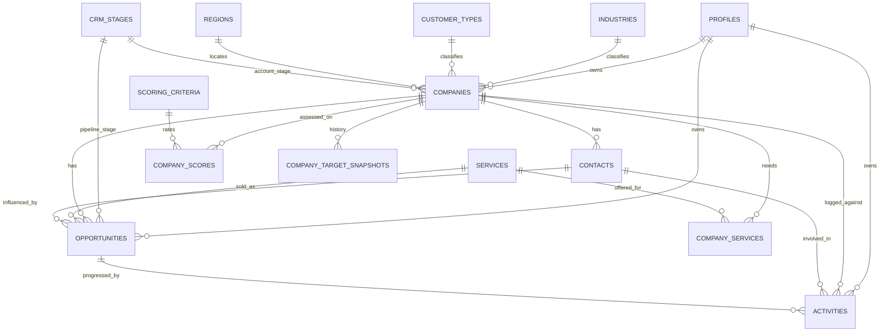

# GEOCHEM STP Intelligence — Database Architecture

This document describes the **normalized relational model** for GEOCHEM STP Intelligence.

- TypeScript domain types: `src/types/`
- Canonical scoring engine: `src/lib/scoring-engine.ts`
- Production SQL: `supabase/migrations/`
- Current UI still reads `src/data/mock.ts` (DEMO / MOCK ASSESSMENT). **The Next.js app is not connected to Supabase yet.**

---

## Design principles

1. **No god table.** Company facts, services, scores, contacts, opportunities, and activities are separate entities.
2. **No generic `segmentation` table.** Segmentation is derived:
   `Company → Industry → Customer Type → Geography → Service needs → Account potential`.
3. **Target score is calculated**, not typed in as company master data. A cache snapshot is allowed later.
4. **Scoring weights and tier thresholds are configuration**, not hard-coded in the scoring function.
5. **One scoring source of truth:** `ScoringSettings` → criteria → scoring engine → target score → tier → UI.
6. **Departments are reference data**, not hard-coded application logic.
7. **Target snapshots freeze** weights, ratings, and thresholds used at assessment time.

The model answers:

| Question | Source |
|---|---|
| Which companies exist? | `companies` |
| How is each company segmented? | industry, customer type, region, city, account potential, company_services |
| Which GEOCHEM services are relevant? | `company_services` + `services` |
| Who should be targeted first, and why? | `company_scores` + calculated snapshot + justifications |
| Who should we contact? | `contacts` |
| What commercial opportunities exist? | `opportunities` |
| What is the next sales action? | `companies.next_action` + `activities` |

---

## STP logic

**Segmentation** classifies the addressable Saudi market:

- Industry (what the account does)
- Customer type (who buys)
- Geography (region + city)
- Service needs (many GEOCHEM lines per account)
- Account potential (strategic value of the relationship)

**Targeting** ranks accounts with a weighted 1–5 model (see Scoring logic).

**Positioning** uses service fit, need level, current supplier, and recommended GEOCHEM service lines on `company_services`.

**Lightweight CRM** tracks stage, contacts, opportunities, and activities without replacing a full enterprise CRM.

---

## Entities and fields

PostgreSQL column names will be `snake_case`. TypeScript uses `camelCase`.

### `profiles`

Future 1:1 map to Supabase Auth (`id` = `auth.users.id`). Not implemented yet.

| Field | Type | Notes |
|---|---|---|
| id | uuid | PK |
| full_name | text | |
| email | text | |
| role | enum | Admin, Manager, Sales_BD |
| job_title | text | |
| active | boolean | |
| created_at | timestamptz | |

### `industries`

Master list: Oil & Gas, Refining, Petrochemicals, Chemicals, Power & Utilities, Water & Wastewater, Industrial Manufacturing, Mining & Minerals, Marine / Ports, EPC / Projects, Government / Public Sector.

| Field | Type |
|---|---|
| id | uuid |
| name | text |
| description | text |
| active | boolean |

### `customer_types`

Master list: Asset Owner, Operator, Manufacturer, EPC Contractor, O&M Contractor, Trader, Government Entity, Technical Partner.

| Field | Type |
|---|---|
| id | uuid |
| name | text |
| description | text |
| active | boolean |

### `regions`

Saudi geography at **region** grain. Cities stay on the company so Yanbu, Jeddah, Rabigh, Jubail, Dammam, Al Khobar, Ras Tanura, Riyadh can be analyzed separately.

Examples: Western Region, Eastern Region, Central Region.

| Field | Type |
|---|---|
| id | uuid |
| name | text |
| country | text |
| industrial_cluster | text |
| active | boolean |

### `services`

GEOCHEM service lines: Petroleum Services; Petrochemical Services; Minerals & Agriculture; Environmental Services; Oil Condition Monitoring; Metering, Calibration & Topography; Industrial Inspection; Laboratory / Testing Services.

| Field | Type |
|---|---|
| id | uuid |
| name | text |
| service_code | text |
| description | text |
| active | boolean |

### `companies`

| Field | Type | Notes |
|---|---|---|
| id | uuid | PK |
| company_name | text | |
| legal_name | text | |
| industry_id | uuid | FK industries |
| subsector | text | |
| customer_type_id | uuid | FK customer_types |
| country | text | Default Saudi Arabia |
| region_id | uuid | FK regions |
| city | text | Not a region |
| website | text | |
| linkedin_url | text | |
| main_phone | text | |
| general_email | text | |
| company_size | text | |
| ownership_type | text | |
| account_status | enum | Prospect, Current Customer, Former Customer, Partner |
| account_potential | enum | Strategic, Growth, Development, Transactional |
| data_confidence | enum | Optional. Verified / Probable / Estimated / Unknown — for judged commercial fields only |
| account_owner_id | uuid | FK profiles |
| crm_stage_id | uuid | FK crm_stages (account-level stage) |
| last_activity_date | date | |
| next_action | text | |
| next_action_date | date | |
| notes | text | |
| created_at | timestamptz | |
| updated_at | timestamptz | |

Do **not** store an editable target score on this table. Optional later: cached snapshot table.

### `company_services`

Many-to-many **Company ↔ Service**. Powers the ACCOUNT × SERVICE matrix and cross-sell.

| Field | Type |
|---|---|
| id | uuid |
| company_id | uuid |
| service_id | uuid |
| need_level | enum High / Medium / Low / Unknown |
| service_fit_rating | int 1–5 |
| current_service_status | enum Not Offered / Prospect / Proposal / Active / Previous |
| current_supplier | text |
| estimated_annual_potential | numeric |
| cross_sell_potential | enum High / Medium / Low |
| data_confidence | enum optional Verified / Probable / Estimated / Unknown |
| notes | text |

Unique constraint recommended: `(company_id, service_id)`.

### `contacts`

One company → many contacts.

| Field | Type |
|---|---|
| id | uuid |
| company_id | uuid |
| full_name | text |
| job_title | text |
| department | text |
| email | text |
| phone | text |
| linkedin_url | text |
| contact_role | enum |
| relationship_strength | enum |
| is_primary | boolean |
| notes | text |
| created_at | timestamptz |
| updated_at | timestamptz |

Department examples (catalog, not code): Procurement, QA/QC, Laboratory, Reliability, Maintenance, HSE, Environment, Inspection, Projects, Engineering.

### `scoring_criteria`

Configurable from Settings. Active weights **must total 100%**.

Canonical production path (do not use `src/lib/constants.ts` LEGACY_DEMO_ONLY weights):

`ScoringSettings` → `ScoringCriteria` → scoring engine → Target Score → Tier → UI

`ScoringSettings` also stores `scoring_model_version` and `tier_threshold_version`.

| Field | Type |
|---|---|
| id | uuid |
| name | text |
| description | text |
| weight | numeric |
| active | boolean |

Initial weights:

| Criterion | Weight | High rating means |
|---|---|---|
| Market Potential | 20% | Large addressable spend |
| GEOCHEM Service Fit | 20% | Strong capability match |
| Recurring Revenue Potential | 15% | Multi-year programs |
| Cross-Selling Potential | 15% | Adjacent service expansion |
| Accessibility | 10% | Reachable buyers / sites |
| Competitive Intensity | 10% | **5 = favorable / low pressure; 1 = very high pressure** |
| Margin Potential | 5% | Attractive contribution |
| Geographic Fit | 5% | Logistics / coverage |

### `company_scores`

One row per company per criterion. This is the assessment, not the roll-up.

| Field | Type |
|---|---|
| id | uuid |
| company_id | uuid |
| criterion_id | uuid |
| rating | int 1–5 |
| justification | text |
| evidence_source | text |
| evidence_url | text nullable |
| evidence_date | date nullable |
| evidence_quality | enum Verified / Strong Evidence / Strategic Estimate / Unknown |
| assessed_by | uuid / text |
| assessed_at | timestamptz |

Rating: 1 Very Low, 2 Low, 3 Medium, 4 High, 5 Very High.

`evidence_quality` separates real market intelligence (Verified / Strong Evidence) from analyst judgment (Strategic Estimate) and unknown demo data.

### `company_target_snapshots`

Historical targeting assessments. One company → many snapshots. Never overwrite history when Settings change.

| Field | Type |
|---|---|
| id | uuid |
| company_id | uuid |
| score_out_of_5 | numeric |
| score_out_of_100 | numeric |
| tier | text |
| assessment_status | enum Draft / Incomplete / Complete / Superseded |
| assessment_date | timestamptz |
| assessed_by | uuid |
| scoring_model_version | text |
| tier_threshold_version | text |
| weight_configuration_snapshot | jsonb |
| rating_snapshot | jsonb |
| (tier thresholds also frozen as) tier_threshold_snapshot | jsonb |
| change_reason | text |
| notes | text |
| created_at | timestamptz |
| assessment_source | text |

Mapped demo rows use `assessment_source = DEMO / MOCK ASSESSMENT` and `evidence_quality = Unknown`.

### `crm_stages`

Prospect, Contacted, Qualified, Meeting, Proposal, Negotiation, Won, Lost.

| Field | Type |
|---|---|
| id | uuid |
| name | text |
| display_order | int |
| active | boolean |

### `opportunities`

One company → many opportunities (often one per service line).

| Field | Type |
|---|---|
| id | uuid |
| company_id | uuid |
| service_id | uuid |
| contact_id | uuid nullable |
| owner_id | uuid |
| opportunity_name | text |
| stage_id | uuid |
| estimated_value | numeric |
| currency | text |
| probability | numeric |
| expected_close_date | date |
| source | text |
| description | text |
| lost_reason | text |
| data_confidence | enum optional |
| created_at | timestamptz |
| updated_at | timestamptz |

### `activities`

| Field | Type |
|---|---|
| id | uuid |
| company_id | uuid |
| contact_id | uuid nullable |
| opportunity_id | uuid nullable |
| owner_id | uuid |
| activity_type | enum Call / Email / Meeting / Site Visit / Proposal / Follow-up / Other |
| subject | text |
| description | text |
| activity_date | timestamptz |
| next_action | text |
| next_action_date | date |
| created_at | timestamptz |

### `departments` (catalog)

Reference rows only. Contacts currently store department as text; later this can become `department_id`.

---

## Relationships

- Industry 1 → many Companies
- CustomerType 1 → many Companies
- Region 1 → many Companies
- Company 1 → many Contacts
- Company many ↔ many Services through CompanyService
- Company 1 → many CompanyScores
- ScoringCriterion 1 → many CompanyScores
- Company 1 → many CompanyTargetSnapshots
- Company 1 → many Opportunities
- Service 1 → many Opportunities
- Company 1 → many Activities
- Contact 1 → many Activities
- Opportunity 1 → many Activities
- CRMStage 1 → many Opportunities (and companies.crm_stage_id)
- Profile 1 → many assigned Companies / Opportunities / Activities



---

## Scoring logic

Implemented in `src/lib/scoring-engine.ts`.

Inputs: active criteria (each with a **passed-in** weight), integer ratings 1–5, optional tier thresholds.

```
score_out_of_5   = Σ (rating × weight_percent / 100)
score_out_of_100 = (score_out_of_5 / 5) × 100
```

Example: 4.25 / 5 = 85 / 100.

Validation:

- Active weights must total **100%** (tolerance 0.01).
- Ratings must be integers 1–5.
- Duplicate ratings for the same criterion are invalid.
- **Missing ratings are listed and block a complete score.** They are never treated as zero.

Competitive Intensity is already a “favorability” rating: a 5 means low competitive pressure. The formula does **not** invert the number.

---

## Tier logic

Thresholds are configuration (`tierThresholds`), defaulting to:

| Tier | Score (0–5) |
|---|---|
| Tier 1 | ≥ 4.00 |
| Tier 2 | 3.00–3.99 |
| Tier 3 | 2.00–2.99 |
| Low Priority | < 2.00 |

The current dashboard still shows older demo cut-offs (80 / 65 / 50 on a 0–100 UI scale) via `LEGACY_DEMO_ONLY_*` in `src/lib/constants.ts`. Those UI constants are not the domain model and must be removed when the UI is wired to the scoring engine.

---

## Target Assessment History

`company_target_snapshots` is the audit log of targeting.

Each snapshot can answer:

- What was the score (`score_out_of_5` / `score_out_of_100`)?
- What tier was assigned?
- Which criterion ratings were used (`rating_snapshot`)?
- Which weights were used (`weight_configuration_snapshot`)?
- Which tier thresholds were used (`tier_threshold_snapshot` + `tier_threshold_version`)?
- Who assessed it, and when?
- Why did the score change (`change_reason`)?

Do not recompute historical scores from current Settings. Future weight edits must not rewrite past snapshots.

---

## Scoring Model Versioning

- `scoring_model_version` identifies the weight set (currently `stp-weights-v1`).
- `tier_threshold_version` identifies the tier cut-offs (currently `stp-tiers-v1`).
- Snapshots copy both version identifiers **and** the JSON payloads for weights and thresholds.
- The scoring engine remains a pure function of the criteria/weights passed in; versioning is data, not a second formula.

Canonical flow:

```
ScoringSettings
    → ScoringCriteria (weights)
    → scoring engine
    → Target Score
    → Tier
    → UI (future) and CompanyTargetSnapshot (history)
```

---

## Evidence Quality

Stored on each `company_scores` row:

| evidence_quality | Meaning |
|---|---|
| Verified | Confirmed market intelligence (document, registration, contract, site evidence) |
| Strong Evidence | Credible secondary sources |
| Strategic Estimate | Analyst judgment |
| Unknown | Insufficient evidence — including all current DEMO / MOCK ASSESSMENT rows |

Also store `justification`, `evidence_source`, `evidence_url`, and `evidence_date`.

Optional `data_confidence` (Verified / Probable / Estimated / Unknown) applies to judged fields on companies, company_services, and opportunities — not to simple master data such as city.

---

## Score Change Tracking

`compareTargetSnapshots(previous, current)` in `src/lib/compare-snapshots.ts` prepares later UI/reporting. It does not recalculate scores.

Expected output:

- Previous Score / Current Score / Score Change
- Previous Tier / Current Tier
- Criteria Improved / Criteria Declined (e.g. Accessibility 2 → 4)
- Reason for Change (`current.change_reason`, plus criterion justification)

Example:

```
Accessibility: 2 → 4
Reason: Vendor registration completed.
```

No UI for this yet.

---

## CRM logic

- Account-level stage: `companies.crm_stage_id`.
- Deal-level stage: `opportunities.stage_id`.
- Next action: latest activity and/or `companies.next_action`.
- Won / Lost sit on the opportunity; lost deals require `lost_reason`.
- A company can hold several opportunities for different GEOCHEM services.

---

## Mock data mapping (frontend → domain)

Existing `src/data/mock.ts` remains the UI source. Mapping is explicit in `src/data/map-ui-mock-to-domain.ts`.

| UI mock field | Domain field |
|---|---|
| name | company_name / legal_name |
| industry | industry_id |
| city | city |
| region (e.g. Eastern Province) | region_id (Eastern / Western / Central) |
| customerType | customer_type_id |
| serviceNeed | extra `company_services` row if distinct |
| accountPotential High/Medium/Nurture | Growth / Development / Transactional |
| targetScore / targetTier | calculated snapshot only |
| bestService | primary `company_services` row |
| crmStage | crm_stage_id + opportunity.stage_id |
| scoring.* (0–100) | company_scores.rating 1–5 via `demoDisplayScoreToRating` |
| pipelineValueSar | opportunities.estimated_value |
| employees | company_size |
| website | website |

All mapped scores set `evidence_source = DEMO / MOCK ASSESSMENT`.

UI industry “Construction & Infrastructure” maps to **EPC / Projects**. UI customer types such as National Oil Company map to **Asset Owner**, Industrial Plant to **Manufacturer**, Service Company to **Technical Partner**.

---

## Production Supabase Schema

PostgreSQL schema for Supabase lives in `supabase/migrations/001_initial_schema.sql`.

- UUID primary keys with `gen_random_uuid()`
- `created_at` / `updated_at` timestamptz (`updated_at` maintained by `set_updated_at()`)
- Master FKs: `ON DELETE RESTRICT`
- Dependent rows (contacts, company_services, scores, snapshots, opportunities, activities): `ON DELETE CASCADE` from `companies`
- Optional people FKs (`account_owner_id`, `owner_id`, `assessed_by`, `contact_id`): `ON DELETE SET NULL`
- CHECK constraints for enums, ratings 1–5, probability 0–100, weights 0–100, tier threshold order
- Unique `(company_id, service_id)` on `company_services`
- `company_scores` allows many rows per company + criterion (assessment history)
- `profiles` is **not** linked to `auth.users` in this migration

SQL `assessment_status` values are `complete` / `incomplete` / `invalid` (engine status). TypeScript also has Draft / Superseded for workflow; map those in the Auth/app step if needed.

---

## Migration Structure

| File | Purpose |
|---|---|
| `supabase/migrations/001_initial_schema.sql` | Tables, FKs, indexes, checks, triggers, views, RLS enablement |
| `supabase/migrations/002_seed_master_data.sql` | Reference data + canonical scoring model v1 |

Apply with Supabase CLI or the SQL editor **after review**. Do not apply from the Next.js app.

---

## Seed Strategy

`002` seeds **master/reference data only**:

- industries, customer_types, regions, departments, services, crm_stages
- scoring_criteria v1 (20/20/15/15/10/10/5/5 = 100)
- scoring_settings v1 (4.00 / 3.00 / 2.00), marked active

A `DO` block aborts the seed if active v1 weights do not total 100.

**Not seeded:** companies, contacts, opportunities, activities, company_scores, snapshots, profiles, pipeline values. Frontend mock accounts (Aramco, SABIC, Ma'aden, etc.) stay in `src/data/mock.ts` only.

---

## RLS Preparation

Row Level Security is **enabled** on all application tables in `001`.

**RLS ENABLED — POLICIES TO BE ADDED IN AUTH STEP.**

There are no policies yet. Once applied, `anon` / `authenticated` clients cannot read or write. That is acceptable because the app is not connected. Table owners and the service role can still operate in the dashboard/CLI.

---

## Master Data

Seeded catalogs match the approved TypeScript reference lists (Saudi Western / Eastern / Central regions; GEOCHEM service lines with codes PET, PCH, MIN, ENV, OCM, MCT, INS, LAB; CRM stages 1–8).

---

## Score History

- Live ratings: `company_scores` (append-only history; no unique on company+criterion)
- Frozen roll-ups: `company_target_snapshots` (weights JSON, ratings JSON, model versions)
- Latest complete snapshot per company: view `company_target_latest`

Do not recompute old snapshots from current `scoring_settings`.

---

## Views

| View | Purpose |
|---|---|
| `company_target_latest` | Latest `assessment_status = 'complete'` snapshot per company |
| `company_pipeline_summary` | Opportunity count and estimated value by company (`non_demo_*` columns ignore `is_demo`) |

---

## Out of scope (next steps)

Connecting the Next.js app, Auth (`profiles.id` = `auth.users.id`), RLS policies, loading production companies, scraping, AI, email, LinkedIn automation, UI redesign.
